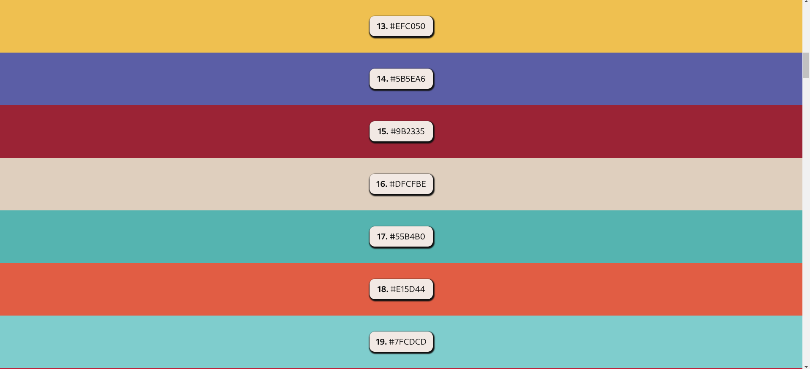
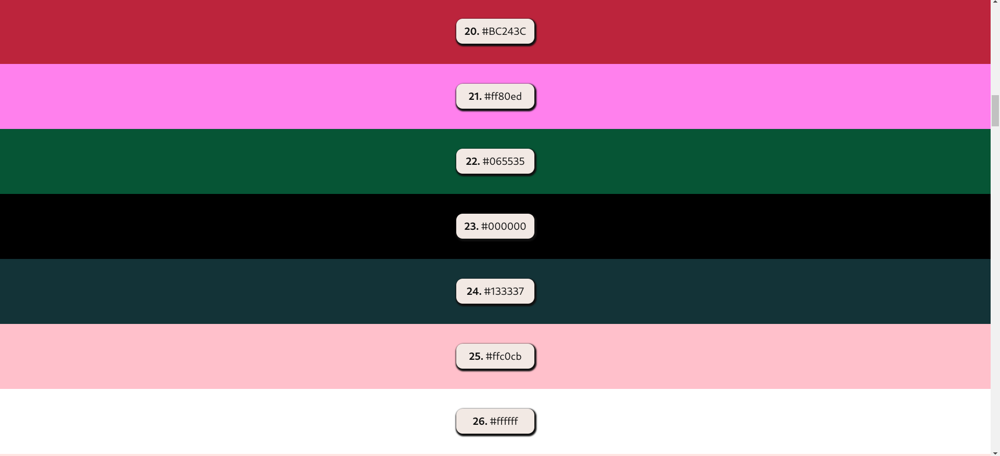
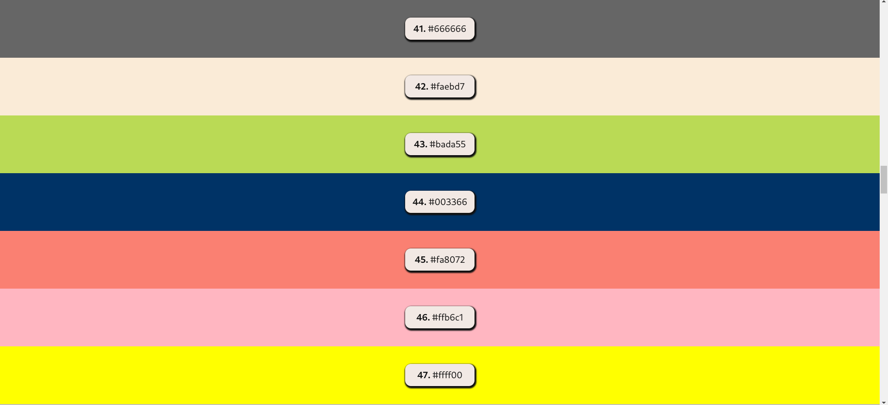
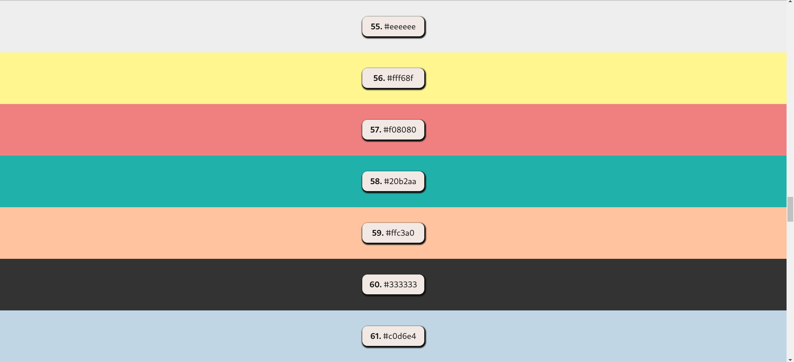
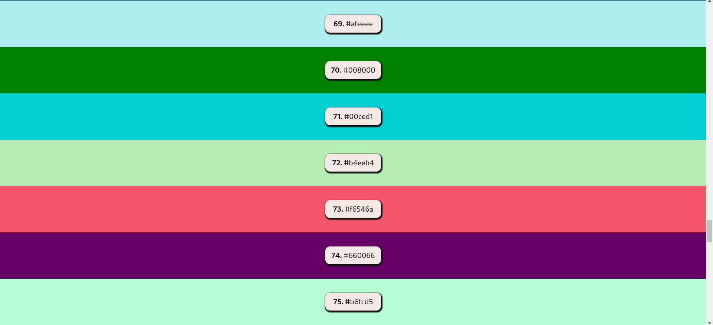
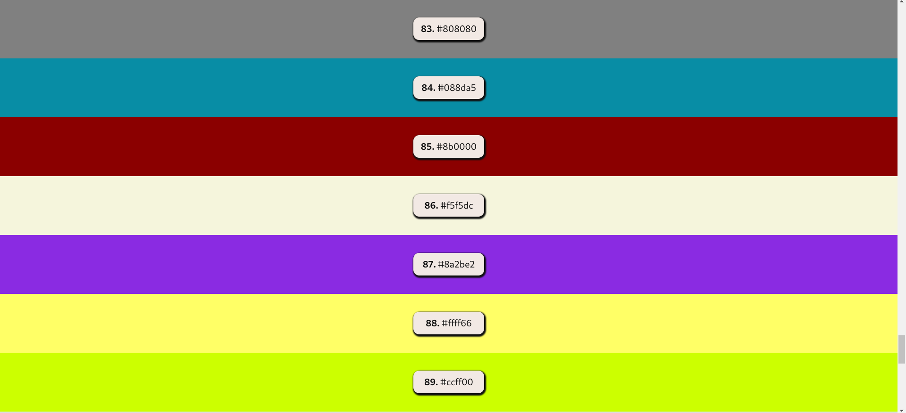
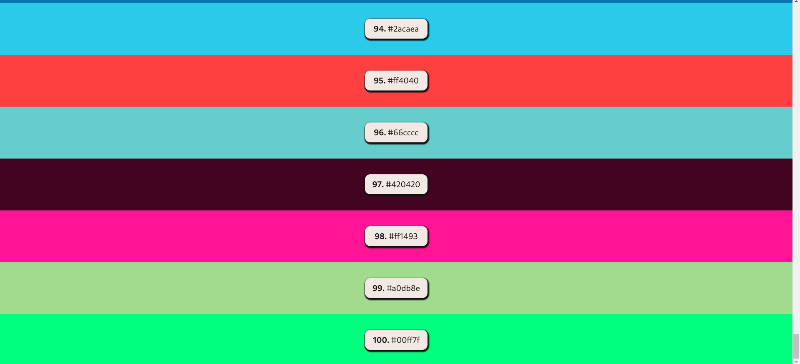

# The Top 100 Colors

There are the best top 100 colors with hex colors code. You can find the best popular colors.
Some of the best colors are below:

+ ***#34568B:*** Hex #34568b is composed of 20.4% red, 33.7% green and 54.5% blue. 
+ ***#FF6F61:*** This is a great light red shade for your next project.
+ ***#6B5B95:*** Hex #6b5b95 is composed of 42% red, 35.7% green and 58.4% blue.
+ ***#88b04b:*** Hex color #88b04b, also known as Greenery, is a medium shade of yellow-green with hints of red. 
+ ***#88b04b:*** The hexadecimal color code #88b04b is a shade of green. In the RGB color model #88b04b is comprised of 
                 53.33%  red, 69.02% green and 29.41% blue
+ ***#000000:*** The hex code for black is #000000.
+ ***#ffffff:*** This color name is White color. #ffffff hex color red value is 255, green value is 255 and the blue 
                 value of its RGB is 255.
+ ***#0000ff:*** This color name is Blue1 color. #0000ff hex color red value is 0, green value is 0 and the blue 
                 value of its RGB is 255.
+ ***#8b0000:*** Dark Red - #8b0000 Hex Code, Shades and Complementary Colors.

-----


## Screenshots















## Before you Begin 🛠 🔨

Quick start:

```
$ npm install
$ npm run dev
$ npm start
```

```
$ pnpm install
$ pnpm run dev
$ pnpm start
```

```
$ yarn install
$ yarn run dev
$ yarn start
```


Head over to https://vitejs.dev/ to learn more about using vite


## Cloning the project 🪛🔨

```
# Clone this repository
$ git clone https://github.com/MastooraTurkmen/The-Top-100-Colors.git

# Go inside the repository
$ cd The-Top-100-Colors
```


------


## Languages and Tools are used 🗣️🔧
 
1. **Languages** 🗣️
    + [HTML](https://github.com/topics/html)
    + [HTML5](https://github.com/topics/html5)
    + [CSS](https://github.com/topics/css)
    + [CSS3](https://github.com/topics/css3)
    + [React](https://github.com/topics/react)
    + [JavaScript](https://github.com/topics/javascript)

2. **Tools** 🔧
    + [Chrome](https://github.com/topics/chrome)
    + [Figma](https://github.com/topics/figma)
    + [VSCode](https://github.com/topics/vscode)
    + [Netlify](https://github.com/topics/netlify)


------


# React + Vite

This template provides a minimal setup to get React working in Vite with HMR and some ESLint rules.
Currently, two official plugins are available:

- [@vitejs/plugin-react](https://github.com/vitejs/vite-plugin-react/blob/main/packages/plugin-react/README.md) uses [Babel](https://babeljs.io/) for Fast Refresh
- [@vitejs/plugin-react-swc](https://github.com/vitejs/vite-plugin-react-swc) uses [SWC](https://swc.rs/) for Fast Refresh


------

